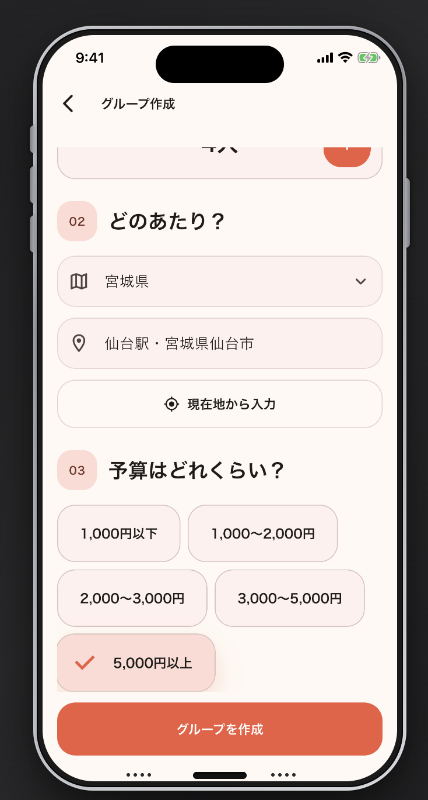
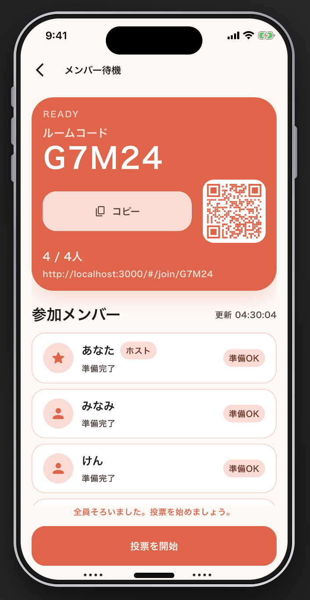

<div align="center">


# GuruMeet

食事会の店選びを、招待リンクとスワイプ投票で決めるアプリ。

<br>

[](https://flutter.dev)
[](https://fastapi.tiangolo.com)
[](https://www.postgresql.org)
[](https://www.cloudflare.com)

</div>

---

## Overview

<div align="center">
  
</div>

GuruMeet は、人数・場所・予算から飲食店候補を出し、参加者がスワイプ投票で店を決める一時グループアプリです。

招待URL / 5桁コードで参加でき、駅・市区町村・現在地を検索原点にできます。
店舗候補は Hot Pepper Gourmet API から取得し、候補の並びは予算・人数・ジャンル分散を見ながら推薦します。

```text
Create group -> Share invite -> Swipe restaurants -> Vote -> Decide
```

<div align="center">
  
  
  
  
</div>

## Features

| feature | status |
| --- | --- |
| 🔗 招待URL / 5桁コード参加 | ✅ |
| 👤 匿名参加者トークン | ✅ |
| 🗾 駅・市区町村検索 | ✅ |
| 📍 現在地検索 | ✅ |
| 🍽️ Hot Pepper 店舗候補取得 | ✅ |
| 👆 スワイプ投票 / 結果表示 | ✅ |
| 🧹 期限切れ cleanup | ✅ |
| ☁️ Cloudflare Workers Containers deploy | ✅ |

## Tech Stack

| layer | technology |
| --- | --- |
| Frontend | Flutter, Dart, Material 3 |
| Backend | FastAPI, Pydantic, SQLAlchemy |
| Database | PostgreSQL, Alembic |
| Recommendation | Budget score, capacity score, genre diversity |
| Location | Geolonia 住所データ, 駅データ.jp, current location |
| Infra | Cloudflare Workers, Workers Containers, R2, Neon PostgreSQL, GitHub Actions |
| Ops | Discord webhook alerts, scheduled cleanup |

## Frontend

<div align="center">
  <a href="https://skillicons.dev">
    
  </a>
</div>

シンプルに使えること、そして店選びがちゃんと美味しそうに見えることを重視しています。
暖色、写真中心のカード、迷わない導線で、食事会らしい温度感を出しています。

```text
frontend/lib/screens   UI screens
frontend/lib/services  API clients
frontend/lib/theme     colors / tokens
```

## Backend

<div align="center">
  <a href="https://skillicons.dev">
    
  </a>
</div>

FastAPI + PostgreSQL で、一時グループ、匿名参加、地点検索、店舗推薦、投票を扱います。
レコメンドはただの取得順ではなく、予算・人数・候補の偏りを見て並べる設計です。

```text
backend/app/api/routes  endpoints
backend/app/services    recommendation / business logic
backend/app/models      SQLAlchemy models
backend/alembic         migrations
```

## Infra

<div align="center">
  <a href="https://skillicons.dev">
    
  </a>
</div>

「楽に開発する」と「Cloudflare を使い倒す」を意識した構成です。
Flutter Web は Worker Static Assets、API は Workers Container 上の FastAPI、DB は Neon PostgreSQL。
Discord webhook でリアルな利用感と障害兆候を拾えるようにしています。

```text
infra/cloudflare/app-worker  Worker entrypoint
infra/cloudflare/Makefile    deploy commands
infra/discord                webhook integration
```

## Quick Start

```sh
cd backend
cp .env.example .env
make dev
make migrate
```

```sh
cd frontend
cp .env.example .env
make install
make dev
```

## Project Layout

```text
gurumeet/
├── frontend/              Flutter app
│   ├── lib/screens/       screens
│   ├── lib/services/      API clients
│   └── lib/theme/         design tokens
├── backend/               FastAPI app
│   ├── app/api/routes/    endpoints
│   ├── app/services/      business logic
│   ├── app/models/        SQLAlchemy models
│   └── alembic/           migrations
├── infra/                 Cloudflare / Discord operations
│   ├── cloudflare/        Worker deploy
│   └── discord/           webhook alerts
├── docs/                  specs, designs, references
└── scripts/               repo helper scripts
```

## Docs

- [Docs Index](./docs/README.md)
- [API](./docs/api/)
- [Database](./docs/database/)
- [Designs](./docs/designs/)
- [Reference](./docs/reference/)
- [Cloudflare Ops](./infra/cloudflare/README.md)

## Developers

| area | developer | comment |
| --- | --- | --- |
| frontend | [https://github.com/jcm2bd9rn5-cyber](https://github.com/jcm2bd9rn5-cyber) | UI職人 |
| backend | [https://github.com/gaku213waka](https://github.com/gaku213waka) | DB設計の鬼 |
| infra | [https://github.com/med-000](https://github.com/med-000) | ヒョロガリ |
