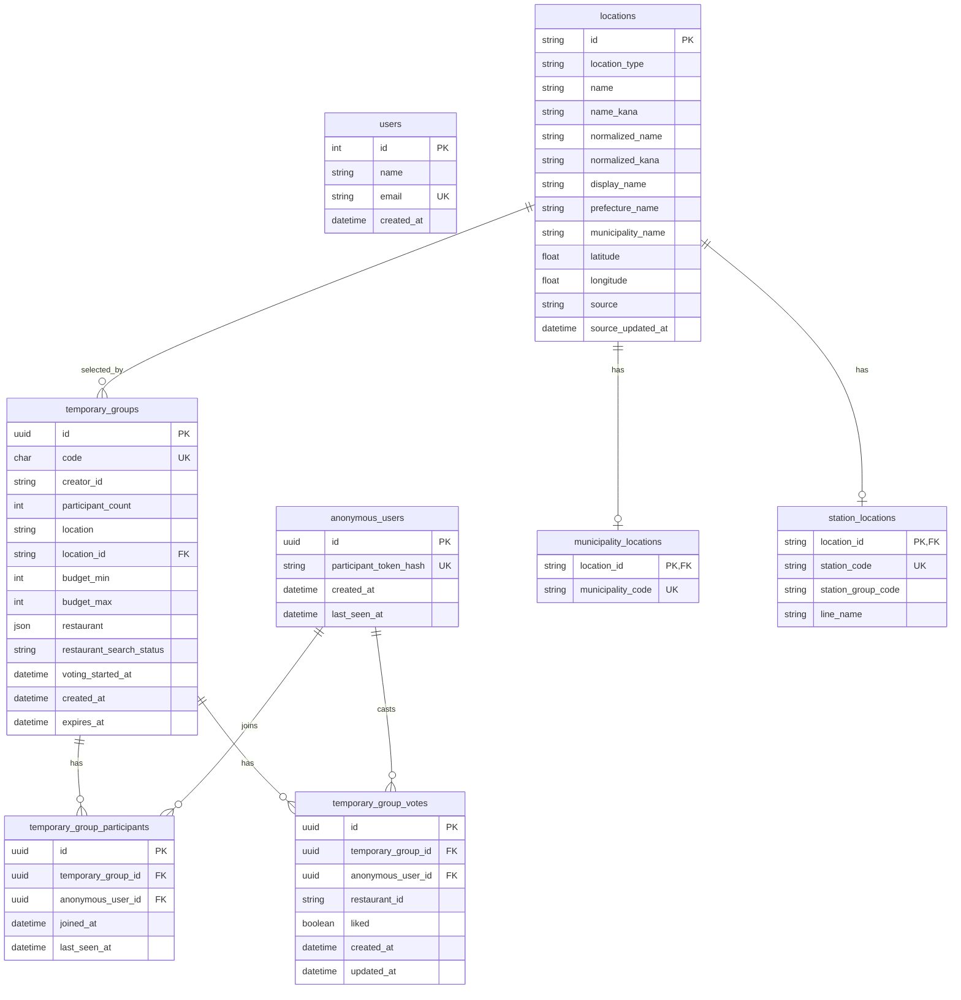
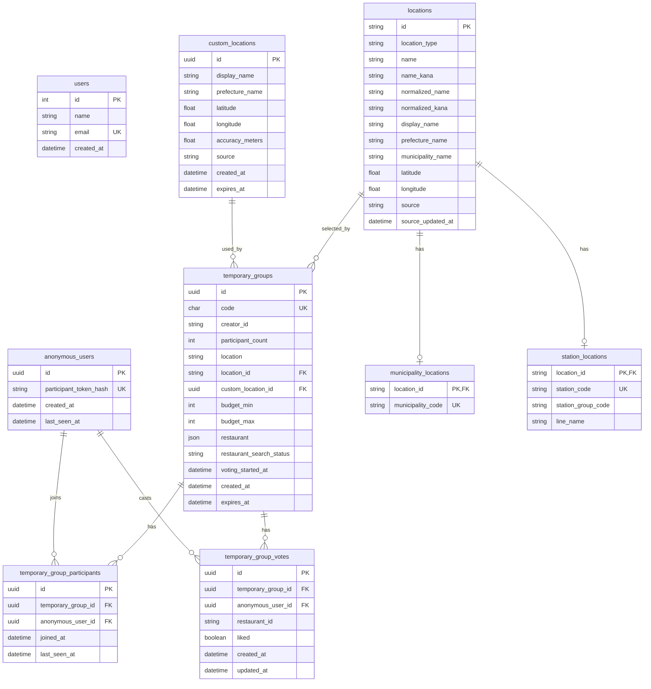

# Database

DB定義の入口。

- [Database Overview](./database.md)
- [Anonymous Users Table](./anonymous-users.md)
- [Location Tables](./locations.md)
- [Temporary Groups Table](./temporary-groups.md)
- [Temporary Group Participants Table](./temporary-group-participants.md)

## ER図

現段階のSQLAlchemyモデルとAlembic migrationに基づくER図。

地点は `locations` を親テーブルにし、市区町村と駅の固有情報を
`municipality_locations` / `station_locations` に分ける。
`temporary_groups` は選択された `locations.id` だけを保持する。

## ER図案: custom_locations を追加する場合

現在地検索は `locations` マスターには登録せず、同じ検索原点レベルの
`custom_locations` として保存する。
駅・市区町村を選んだ場合は `temporary_groups.location_id` を使い、
現在地から探す場合は `temporary_groups.custom_location_id` を使う。

### location_id と custom_location_id の扱い

`temporary_groups.location` は表示名として残す。
検索原点は `location_id` / `custom_location_id` で分岐する。

| case | location_id | custom_location_id | meaning |
| --- | --- | --- | --- |
| 駅・市区町村を選択 | required | null | `locations` から緯度経度と検索半径を解決する。 |
| 現在地から入力 | null | required | `custom_locations` の緯度経度をそのまま検索原点にする。 |
| 自由入力のみ | null | null | 表示名だけ保存する。店舗検索は行わない、または後続で別処理にする。 |

`location_id` と `custom_location_id` は同時に入れない。
最初のmigrationではDB制約を強くしすぎず、nullable FK追加とservice層の
バリデーションで始める。運用が固まったら排他制約をCHECK制約に寄せる。

`custom_locations.source` は当面 `current_location` を想定する。
後で地図ピン指定を入れる場合は `map_pin` を追加する。
