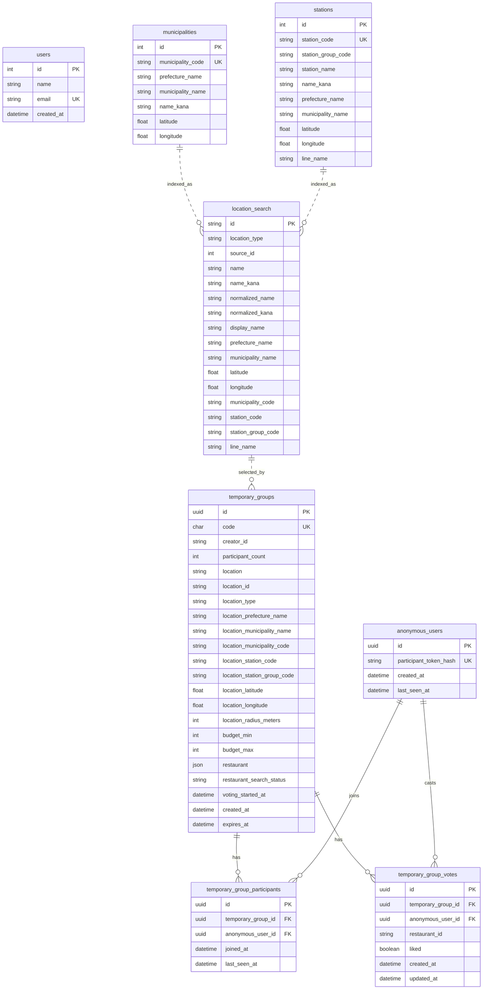

# Database

DB定義の入口。

- [Database Overview](./database.md)
- [Anonymous Users Table](./anonymous-users.md)
- [Location Tables](./locations.md)
- [Temporary Groups Table](./temporary-groups.md)
- [Temporary Group Participants Table](./temporary-group-participants.md)

## ER図

現段階のSQLAlchemyモデルとAlembic migrationに基づくER図。

`location_search` は市区町村・駅を統合した検索用テーブルで、`source_id` は
`municipalities.id` または `stations.id` を指す論理参照です。DB上の物理FKではありません。
`temporary_groups.location_id` も `location_search.id` を保持する論理参照です。

