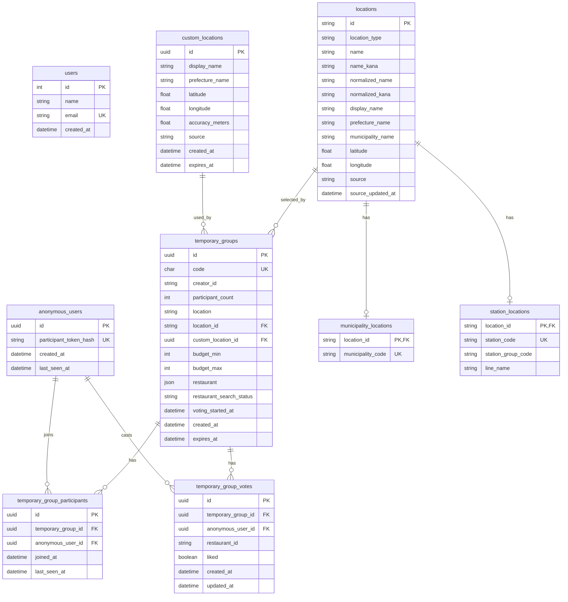

# Database

DB定義の入口。

- [Database Overview](./database.md)
- [Anonymous Users Table](./anonymous-users.md)
- [Location Tables](./locations.md)
- [Custom Locations Table](./custom-locations.md)
- [Temporary Groups Table](./temporary-groups.md)
- [Temporary Group Participants Table](./temporary-group-participants.md)

## ER図

現段階のSQLAlchemyモデルとAlembic migrationに基づくER図。

地点マスタは `locations` を親テーブルにし、市区町村と駅の固有情報を
`municipality_locations` / `station_locations` に分ける。
現在地や地図ピンなど、地点マスタに登録しない検索原点は
`custom_locations` に保存する。

`temporary_groups` は、駅・市区町村を選んだ場合は `location_id`、
現在地から入力した場合は `custom_location_id` を保持する。

## 検索原点の扱い

`temporary_groups.location` は画面表示用の場所名として残す。
Hot Pepper検索に使う原点は `location_id` / `custom_location_id` で分岐する。

| case | location_id | custom_location_id | meaning |
| --- | --- | --- | --- |
| 駅・市区町村を選択 | required | null | `locations` から緯度経度と検索半径を解決する。 |
| 現在地から入力 | null | required | `custom_locations` の緯度経度をそのまま検索原点にする。 |
| 場所指定なし | null | null | 店舗検索は行わない。 |

`location_id` と `custom_location_id` は同時に使わない。
`location` だけを送る自由入力は、検索原点が解決できないためAPIで400にする。
現状はDBのCHECK制約ではなく、service層のバリデーションで排他にする。

`custom_locations.source` は `current_location` / `map_pin` を許可する。
現在のフロントエンドでは、現在地検索は `current_location` として送信する。
